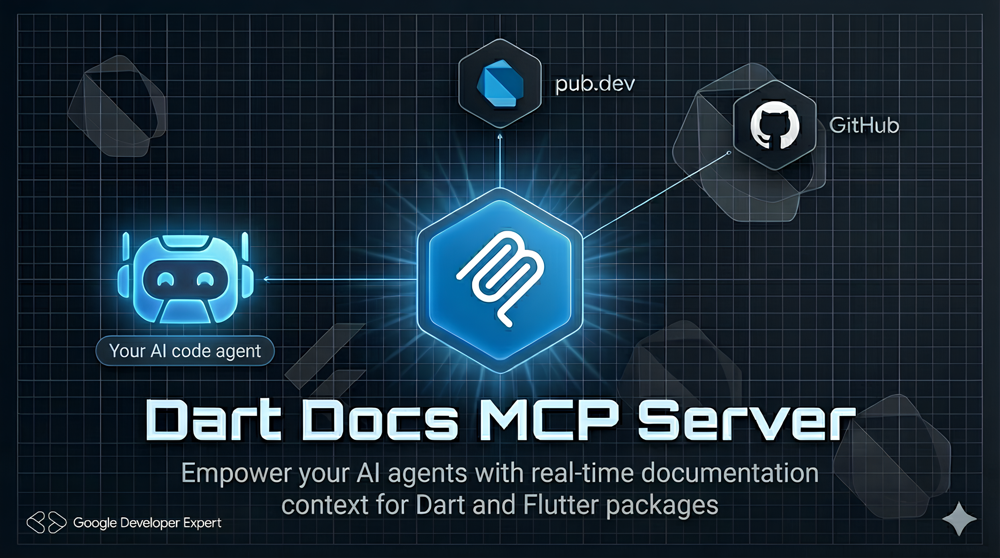

<p align="center">
  
</p>

<p align="center">
  
  
</p>

<p align="center">
  <b>Documentation & context fetcher for Dart & Flutter packages</b><br>
  <i>Agent-agnostic. Pub.dev integrated. Zero-cloning required.</i>
</p>

<p align="center">
  <a href="#installation">Installation</a> •
  <a href="#tools-exposed">Tools</a> •
  <a href="#architecture">Architecture</a> •
  <a href="#adding-to-an-mcp-client">Client Setup</a> •
  <a href="#local-testing--debugging">Testing</a>
</p>

---

Your AI coding agent knows the language. **dart_docs_mcp** gives it the library knowledge it's missing.

A **Dart-based MCP server** that fetches metadata, READMEs, examples, and API surfaces directly from pub.dev and GitHub. Works with **any agent** that supports MCP — Gemini CLI, Antigravity, Claude Code, Cursor, or anything else.

## Features

- 📦 **Metadata & Docs**: Fetches READMEs and `example/` directories for instant library onboarding.
- 🔍 **API Surface Exploration**: Provides a concise "virtual header" of public classes and methods.
- ⚡ **Source Grepping**: Search internal `lib/` files using regex without cloning the repository.
- 📈 **Changelog Intelligence**: Extracts targeted version ranges to assist with migrations and breaking changes.
- 🌳 **Type Hierarchy**: Reconstructs inheritance trees for complex class structures.

## Installation

### Via Homebrew (macOS & Linux)

```bash
brew tap alfredobs97/tap
brew install dart-docs-mcp
```

### Running Locally (Development)

```bash
dart run bin/server.dart
```

### Using Docker

```bash
# Production AOT build
docker build --target runtime -t dart-docs-mcp:latest .
docker run -i dart-docs-mcp:latest
```

## Tools Exposed

| Tool | Capability |
|------|-------------|
| `get_package_docs` | Fetch README + `example/` for usage context. |
| `get_api_surface` | Get a "virtual header" of all public APIs from `index.json`. |
| `search_package_code` | Grep internal source code via keyword/regex (capped at 15 matches). |
| `get_changelog` | Targeted version diffs between specific releases. |
| `get_type_hierarchy` | Map class inheritance and implementations (e.g., sealed classes). |
| `cross_reference` | Map README features to specific implementation files. |

## Architecture

This server is built using the [Model Context Protocol (MCP)](https://modelcontextprotocol.io/), an open standard that enables AI models to interact with local and remote tools.

1. **Request**: An MCP client sends a JSON-RPC request over `stdio`.
2. **Orchestration**: The server routes requests to specific tool implementations in `lib/mcp/tools/`.
3. **Execution**: Services fetch data from **pub.dev API**, **Dartdoc assets**, and **GitHub** fallbacks.
4. **Response**: Context is formatted and injected back into the LLM's conversation.

## Adding to an MCP Client

### Gemini CLI
```bash
gemini mcp add local stdio dart_docs_mcp --command dart-docs-mcp
```

### Google Antigravity IDE
Add this to your MCP configuration JSON:
```json
{
  "mcpServers": {
    "dart_docs_mcp": {
      "command": "dart-docs-mcp",
      "args": []
    }
  }
}
```

### Claude Code
```bash
claude mcp add dart_docs_mcp -- dart-docs-mcp
```

## Local Testing & Debugging

Use the [`mcp_dart_cli`](https://github.com/leehack/mcp_dart) inspector to call tools manually:

```bash
# Install the CLI
dart pub global activate mcp_dart_cli

# Test a tool query
mcp_dart inspect --tool get_package_docs --json-args '{"package_name": "http"}'
```

## Testing

```bash
dart test
```